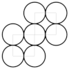

# O-O-O-O-O-O-O

 content addressed persistence for data structures. Neo4j inspired index-free adjacency for navigation efficiency. Vertex, edge and property data are fixed size records stored in logical byte arrays. Property values are stored as variable size records in a logical byte array. Internal references are offsets in the logical byte array. The logical byte arrays are partitioned in data blocks using content defined chunking. The data blocks, are effectively immutable and identified w/ cryptographic hashes. Depending on graph topology, edge indexing can minimize the number of block reads, hence accelerate navigation. Indexing is using the [prolly trees](https://www.npmjs.com/package/prolly-trees) library.

## Demo

[Hello World](https://github.com/dstanesc/O-O-O-O-O-O-O-H)

## Graph Example

Author data graphs. Providing a `proto-schema` is optional.

```ts
enum ObjectTypes {
    FOLDER = 1,
    FILE = 2,
}
enum RlshpTypes {
    CONTAINS = 1,
}
enum PropTypes {
    META = 1,
    DATA = 2,
}
enum KeyTypes {
    NAME = 1,
    CONTENT = 2,
}

const { chunk } = chunkerFactory(512, compute_chunks)
const linkCodec: LinkCodec = linkCodecFactory()
const blockCodec: BlockCodec = blockCodecFactory()
const blockStore: BlockStore = memoryBlockStoreFactory() // memory store
const story: VersionStore = await versionStoreFactory({
    chunk,
    linkCodec,
    blockCodec,
    blockStore,
})
const store = graphStore({ chunk, linkCodec, blockCodec, blockStore })

const graph = new Graph(story, store)

const tx = graph.tx()

await tx.start()

const v1 = tx.addVertex(ObjectTypes.FOLDER)
const v2 = tx.addVertex(ObjectTypes.FOLDER)
const v3 = tx.addVertex(ObjectTypes.FILE)

const e1 = await tx.addEdge(v1, v2, RlshpTypes.CONTAINS)
const e2 = await tx.addEdge(v1, v3, RlshpTypes.CONTAINS)

await tx.addVertexProp(v1, KeyTypes.NAME, 'root-folder', PropTypes.META)
await tx.addVertexProp(v2, KeyTypes.NAME, 'nested-folder', PropTypes.META)
await tx.addVertexProp(v3, KeyTypes.NAME, 'nested-file', PropTypes.META)
await tx.addVertexProp(
    v2,
    KeyTypes.CONTENT,
    'hello world from v2',
    PropTypes.DATA
)
await tx.addVertexProp(
    v3,
    KeyTypes.CONTENT,
    'hello world from v3',
    PropTypes.DATA
)

const { root, index, blocks } = await tx.commit({
    comment: 'First draft',
    tags: ['v0.0.1'],
})
```

Generated blocks are stored in the provided `blockstore` but can also be pushed to other stores

```ts
import { blockStore as idbStore } from '@dstanesc/idb-block-store'
const blockStore2 = idbStore({})
await blockStore.push(blockStore2)
```

Navigate the graph, filter the data and extract vertex, edge or property information

```ts
const query = async (versionRoot: Link): Promise<Prop[]> => {
    const versionStore: VersionStore = await versionStoreFactory({
        versionRoot,
        chunk,
        linkCodec,
        blockCodec,
        blockStore,
    })
    const store = graphStore({ chunk, linkCodec, blockCodec, blockStore })
    const graph = new Graph(versionStore, store)
    const request = new RequestBuilder()
        .add(PathElemType.VERTEX)
        .add(PathElemType.EDGE)
        .add(PathElemType.VERTEX)
        .propPred(KeyTypes.CONTENT, eq('hello world from v3'))
        .extract(KeyTypes.NAME)
        .maxResults(100)
        .get()

    const vr: Prop[] = []
    for await (const result of navigateVertices(graph, [0], request)) {
        vr.push(result as Prop)
    }
    return vr
}
```

... or extract coarser data fragments using templates. Proto-language / syntax still under evaluation. _WIP_

```ts
const DATA_TEMPLATE = {
    fileName: {
        $elemType: PathElemType.EXTRACT,
        $type: KeyTypes.NAME,
    },
    includes: {
        $elemType: PathElemType.EDGE,
        $type: RlshpTypes.CONTAINS,
        fileName: {
            $elemType: PathElemType.EXTRACT,
            $type: KeyTypes.NAME,
        },
    },
}

const request = new RequestBuilder()
    .add(PathElemType.VERTEX)
    .add(PathElemType.EDGE)
    .add(PathElemType.VERTEX)
    .template(DATA_TEMPLATE)
    .maxResults(100)
    .get()

const vr: any[] = []
for await (const result of navigateVertices(graph, [0], request)) {
    vr.push(result)
}
```

## List Example

_WIP_

A list is a collection of items. An item is a collection of values. Items are stored as vertices in a linear (ie. O-O-O-O-O-O-O) graph. Item values are stored as vertex properties. Vertices are connected with an implicit _parent_ edge.

```ts
enum KeyTypes {
    NAME = 1,
}
const { chunk } = chunkerFactory(512, compute_chunks)
const linkCodec: LinkCodec = linkCodecFactory()
const blockCodec: BlockCodec = blockCodecFactory()
const valueCodec: ValueCodec = valueCodecFactory()
const blockStore: BlockStore = memoryBlockStoreFactory()
const versionStore: VersionStore = await versionStoreFactory({
    chunk,
    linkCodec,
    blockCodec,
    blockStore,
})
const store = graphStore({ chunk, linkCodec, valueCodec, blockStore })
const itemList: ItemList = itemListFactory(versionStore, store)
const tx = itemList.tx()
await tx.start()
await tx.push(new Map([[KeyTypes.NAME, 'item 0']]))
await tx.push(new Map([[KeyTypes.NAME, 'item 1']]))
await tx.push(new Map([[KeyTypes.NAME, 'item 2']]))
const { root, index, blocks } = await tx.commit({
    comment: 'First commit',
    tags: ['v0.0.1'],
})
```

The technology is suitable for very large lists. As vertex records have a fixed size, item access by index is translated into access by offset, therefore constant - O(1). Retrieving the length of the list is also constant - O(1).

```ts
const len = await itemList.length()
assert.strictEqual(3, len)
const item0 = await itemList.get(0)
assert.strictEqual('item 0', item0.get(KeyTypes.NAME))
const item1 = await itemList.get(1)
assert.strictEqual('item 1', item1.get(KeyTypes.NAME))
const item2 = await itemList.get(2)
assert.strictEqual('item 2', item2.get(KeyTypes.NAME))
```

## Multiple block stores

-   [IndexedDB](https://www.npmjs.com/package/@dstanesc/idb-block-store) for browser local
-   [Azure](https://www.npmjs.com/package/@dstanesc/az-block-store)
-   [S3](https://www.npmjs.com/package/@dstanesc/s3-block-store)
-   [IPFS](https://www.npmjs.com/package/@dstanesc/ipfs-block-store)
-   [IPFS over HTTP](https://www.npmjs.com/package/@dstanesc/http-block-store)
-   [Lucy](https://www.npmjs.com/package/@dstanesc/lucy-block-store) to store blocks everywhere

or provide your own

```ts
interface BlockStore {
    put: (block: { cid: any; bytes: Uint8Array }) => Promise<void>
    get: (cid: any) => Promise<Uint8Array>
}
```

## Multiple APIs

_WIP_

-   Native
-   Proto-gremlin
-   ...

## Build

```sh
npm run clean
npm install
npm run build
npm run test
```

## Licenses

Licensed under either [Apache 2.0](http://opensource.org/licenses/MIT) or [MIT](http://opensource.org/licenses/MIT) at your option.
