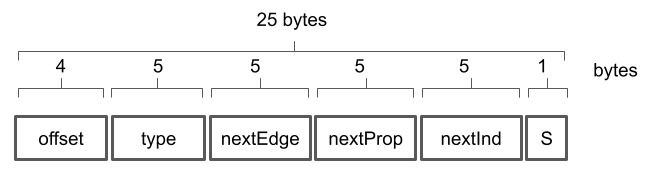
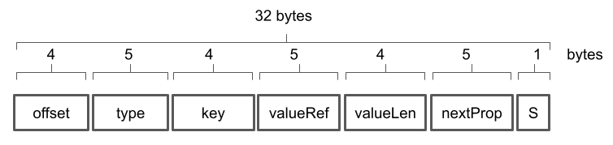
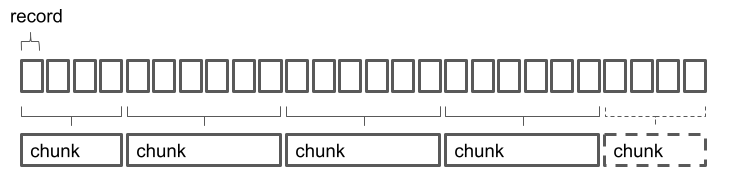
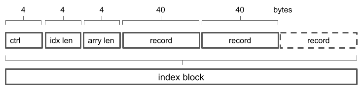

# O-O-O-O-O-O-O

 content addressed [persistent data structures](https://en.wikipedia.org/wiki/Persistent_data_structure). The graph is the primary representation. Vertex, edge and property data are fixed size records stored in logical byte arrays. Property values are stored as variable size records in a logical byte array. Internal references are offsets in the logical byte array. The logical byte arrays are partitioned in data blocks using content defined chunking. The data blocks are uniquely identified w/ cryptographic hashes ie. content identifiers. Each individual version of the data structure is uniquely identified w/ a cryptographic hash - _the root_.

# Storage Format

Neo4j inspired index-free adjacency. Vertices, edges and properties are stored in distinct, single category, byte arrays. The records are having _fixed size_. The records are identified by their offset in the byte array. References are merely pointers to byte array offsets. The (property) values are stored as _variable size_ records in a dedicated byte array. The (property) value records are identified and referenced by their offset and the corresponding byte length in the byte array. Both vertices and edges can have properties.


# Vertex Binary Format

Vertices are stored as fixed size records of 25 bytes. First 4 bytes represent the vertex identity and corresponds to the offset in the byte array storage. The next 5 bytes describe the vertex type. First byte of the 5 byte sequence is a marker for existence of the type specification. Can store additional flags in the future. The next 5 bytes represent a reference to the first edge in the edge list associated with the vertex. The next 5 bytes represent a reference to the first property in the property list associated with the vertex. Last byte describes the record status, such `created`, `modified` or `deleted`.



# Edge Binary Format

Edges are stored in a double-linked list as fixed size records of 32 bytes. First 4 bytes represent the edge identity and corresponds to the offset in the byte array storage. The next 5 bytes describe the edge type. The next 5 bytes represent a reference to the source vertex. The next 5 bytes represent a reference to the target vertex. The next 5 bytes represent a reference to the previous edge in the edge list associated with the source vertex. The next 5 bytes represent a reference to the next edge in the edge list associated with the source vertex. The next 5 bytes represent a reference to the previous edge in the edge list associated with the target vertex. The next 5 bytes represent a reference to the next edge in the edge list associated with the target vertex. The next 5 bytes represent a reference to the first property in the property list associated with the edge. Last byte describes the record status, such `created`, `modified` or `deleted`.


# Property Binary Format

Properties are stored as fixed size records of 32 bytes. First 4 bytes represent the property identity and corresponds to the offset in the byte array storage. The next 5 bytes describe the property type. The next 4 bytes are the property key. The next 5 bytes are the offset of the property value in the property value byte array. The next 4 bytes represent the byte length of the property value. The next 5 bytes represent a reference to the next property in a given property list. Last byte describes the record status, such `created`, `modified` or `deleted`.



# Byte Array Chunking

Network transfer efficiency is reached by partitioning the large byte arrays associated with vertices, edges, properties and property values into smaller chunks. It is also imperative that the chunking algorithm remains stable, which is generates identical chunks for contiguous unchanged data. At this stage, the graph library employs content-defined chunking for all underlying byte arrays, more specifically the [FastCDC algorithm](https://github.com/nlfiedler/fastcdc-rs).



Each chunk is identified by its content-identifier (CID). The CID is a cryptographic hash (such SHA-256) of the chunk content. The chunk information is organized in a cid-by-offset search index so that data associated with ranges in the byte array can be accessed extremely efficient - O(1). The records have a fixed size of 40 bytes. The first 4 bytes represent the relative chunk offset in the logical byte array. The next 36 bytes are the CID:


The index header stores the index length as well as the byte array length:



Any byte array record can be accessed or modified using the index handle (the CID of the index), the record absolute offset and record size. An externalized [generic library](https://github.com/dstanesc/store-chunky-bytes) is used for logical byte array editing.

# Storage Providers

The library can store the data across many technologies or providers. The API is fundamentally a key-value store. The key is the content-identifier (CID) of the chunk and the value is the actual byte array fragment associated with the chunk:

```ts
interface BlockStore {
    put: (block: { cid: any; bytes: Uint8Array }) => Promise<void>
    get: (cid: any) => Promise<Uint8Array>
}
```

Few examples of the storage providers:

-   [IndexedDB](https://www.npmjs.com/package/@dstanesc/idb-block-store) for browser local
-   [Azure](https://www.npmjs.com/package/@dstanesc/az-block-store)
-   [S3](https://www.npmjs.com/package/@dstanesc/s3-block-store)
-   [IPFS](https://www.npmjs.com/package/@dstanesc/ipfs-block-store)
-   [IPFS over HTTP](https://www.npmjs.com/package/@dstanesc/http-block-store)
-   [Lucy](https://www.npmjs.com/package/@dstanesc/lucy-block-store) to store blocks everywhere

# Graphs

## Authoring

Providing a `proto-schema` is optional. Below creating, updating in parallel and merging changes on a graph structure mimicking a file system:

```ts
/**
 * File system proto-schema
 */

enum ObjectTypes {
    FOLDER = 1,
    FILE = 2,
}
enum RlshpTypes {
    CONTAINS = 1,
}
enum PropTypes {
    META = 1,
    DATA = 2,
}
enum KeyTypes {
    NAME = 1,
    CONTENT = 2,
}

/**
 * Chunking alg., codecs, storage
 */
const { chunk } = chunkerFactory(512, compute_chunks)
const linkCodec: LinkCodec = linkCodecFactory()
const valueCodec: ValueCodec = valueCodecFactory()
const blockStore: BlockStore = memoryBlockStoreFactory()
const versionStore: VersionStore = await versionStoreFactory({
    chunk,
    linkCodec,
    valueCodec,
    blockStore,
})
const graphStore = graphStoreFactory({
    chunk,
    linkCodec,
    valueCodec,
    blockStore,
})

/**
 * Build original data set
 */
const graph = new Graph(versionStore, graphStore)

const tx = graph.tx()

await tx.start()

const v1 = tx.addVertex(ObjectTypes.FOLDER)
const v2 = tx.addVertex(ObjectTypes.FOLDER)
const v3 = tx.addVertex(ObjectTypes.FILE)

const e1 = await tx.addEdge(v1, v2, RlshpTypes.CONTAINS)
const e2 = await tx.addEdge(v1, v3, RlshpTypes.CONTAINS)

await tx.addVertexProp(v1, KeyTypes.NAME, 'root-folder', PropTypes.META)
await tx.addVertexProp(v2, KeyTypes.NAME, 'nested-folder', PropTypes.META)
await tx.addVertexProp(v3, KeyTypes.NAME, 'nested-file', PropTypes.META)
await tx.addVertexProp(
    v2,
    KeyTypes.CONTENT,
    'hello world from v2',
    PropTypes.DATA
)
await tx.addVertexProp(
    v3,
    KeyTypes.CONTENT,
    'hello world from v3',
    PropTypes.DATA
)

const { root: original } = await tx.commit({
    comment: 'First draft',
    tags: ['v0.0.1'],
})
```

## Revising

```ts
/**
 * Revise original, first user
 */

const graphStore1 = graphStoreFactory({
    chunk,
    linkCodec,
    valueCodec,
    blockStore,
})
const g1 = new Graph(versionStore, graphStore1)

const tx1 = g1.tx()
await tx1.start()
const v10 = await tx1.getVertex(0)
const v11 = tx1.addVertex(ObjectTypes.FILE)
const e11 = await tx1.addEdge(v10, v11, RlshpTypes.CONTAINS)
await tx1.addVertexProp(
    v11,
    KeyTypes.NAME,
    'nested-file-user-1',
    PropTypes.META
)
await tx1.addVertexProp(
    v11,
    KeyTypes.CONTENT,
    'hello world from v11',
    PropTypes.DATA
)

const { root: first } = await tx1.commit({
    comment: 'Revised by first user',
})

/**
 * Revise original, second user
 */
versionStore.checkout(original)

const graphStore2 = graphStoreFactory({
    chunk,
    linkCodec,
    valueCodec,
    blockStore,
})
const g2 = new Graph(versionStore, graphStore2)

const tx2 = g2.tx()
await tx2.start()
const v20 = await tx2.getVertex(0)
const v21 = tx2.addVertex(ObjectTypes.FILE)
const e21 = await tx2.addEdge(v20, v21, RlshpTypes.CONTAINS)
await tx2.addVertexProp(
    v21,
    KeyTypes.NAME,
    'nested-file-user-2',
    PropTypes.META
)
await tx2.addVertexProp(
    v21,
    KeyTypes.CONTENT,
    'hello world from v21',
    PropTypes.DATA
)

const { root: second } = await tx2.commit({
    comment: 'Revised by second user',
})
```

## Merging

```ts
/**
 * Merge MultiValueRegistry
 */

const {
    root: mergeRootMvr,
    index: mergeIndexMvr,
    blocks: mergeBlocksMvr,
} = await merge(
    {
        baseRoot: original,
        baseStore: blockStore,
        currentRoot: first,
        currentStore: blockStore,
        otherRoot: second,
        otherStore: blockStore,
    },
    MergePolicyEnum.MultiValueRegistry,
    chunk,
    linkCodec,
    valueCodec
)

const mergedFilesMvr = await query(mergeRootMvr)

assert.strictEqual(mergedFilesMvr.length, 4)
assert.strictEqual(mergedFilesMvr[0].value, 'nested-folder')
assert.strictEqual(mergedFilesMvr[1].value, 'nested-file')
assert.strictEqual(mergedFilesMvr[2].value, 'nested-file-user-2')
assert.strictEqual(mergedFilesMvr[3].value, 'nested-file-user-1')

/**
 * Merge LastWriterWins
 */

const {
    root: mergeRootLww,
    index: mergeIndexLww,
    blocks: mergeBlocksLww,
} = await merge(
    {
        baseRoot: original,
        baseStore: blockStore,
        currentRoot: first,
        currentStore: blockStore,
        otherRoot: second,
        otherStore: blockStore,
    },
    MergePolicyEnum.LastWriterWins,
    chunk,
    linkCodec,
    valueCodec
)

const mergedFilesLww = await query(mergeRootLww)

assert.strictEqual(mergedFilesLww.length, 3)
assert.strictEqual(mergedFilesLww[0].value, 'nested-folder')
assert.strictEqual(mergedFilesLww[1].value, 'nested-file')
assert.strictEqual(mergedFilesLww[2].value, 'nested-file-user-1')
```

## Navigate

Filter the data and extract vertex, edge or property information

```ts
const query = async (versionRoot: Link): Promise<Prop[]> => {
    const versionStore: VersionStore = await versionStoreFactory({
        versionRoot,
        chunk,
        linkCodec,
        valueCodec,
        blockStore,
    })
    const graphStore = graphStoreFactory({
        chunk,
        linkCodec,
        valueCodec,
        blockStore,
    })
    const graph = new Graph(versionStore, graphStore)
    const request = new RequestBuilder()
        .add(PathElemType.VERTEX)
        .add(PathElemType.EDGE)
        .add(PathElemType.VERTEX)
        // .propPred(KeyTypes.CONTENT, eq('hello world from v3'))
        .extract(KeyTypes.NAME)
        .maxResults(100)
        .get()

    const vr: Prop[] = []
    for await (const result of navigateVertices(graph, [0], request)) {
        vr.push(result as Prop)
    }
    return vr
}
```

... or extract coarser data fragments using data templates. Proto-language / syntax still under evaluation, hinting towards GraphQL.

```ts
const DATA_TEMPLATE = {
    fileName: {
        $elemType: PathElemType.EXTRACT,
        $type: KeyTypes.NAME,
    },
    includes: {
        $elemType: PathElemType.EDGE,
        $type: RlshpTypes.CONTAINS,
        fileName: {
            $elemType: PathElemType.EXTRACT,
            $type: KeyTypes.NAME,
        },
    },
}

const request = new RequestBuilder()
    .add(PathElemType.VERTEX)
    .add(PathElemType.EDGE)
    .add(PathElemType.VERTEX)
    .template(DATA_TEMPLATE)
    .maxResults(100)
    .get()

const vr: any[] = []
for await (const result of navigateVertices(graph, [0], request)) {
    vr.push(result)
}
```

## Bundle

Bundles consist of more `Blocks` assembled in a larger `Block`:

```ts
type Block = {
    cid: CID
    bytes: Uint8Array
}
```

They can be used to transfer data between systems or to store a complete graph in a single file. As any other `Block` bundles can also be stored in a BlockStore.

```ts
const g: ProtoGremlin = protoGremlinFactory({
    chunk,
    linkCodec,
    valueCodec,
    blockStore,
    versionStore,
}).g()

/**
 * Bundle complete graphs into a single block. Restore the bundle into a new block store.
 */
const bundle1: Block = await g.pack(versionRoot)

/**
 * Bundle a section of the graph, derived from a vertex range
 */
const bundle2: Block = await g.packFragment(808775, 1, versionRoot)

/**
 * Bundle single commit
 */
const tx = g.tx()
//...
const commit = await tx.commit({})
const { packCommit } = graphPackerFactory(linkCodec)
const bundle3: Block = await packCommit(commit)

const { unpack, restore } = graphPackerFactory(linkCodec)

/**
 * Unpack the bundle
 */
const { root, index, blocks } = await unpack(bundle.bytes)

/**
 * Restore the bundle into a new block store
 */
const emptyStore: MemoryBlockStore = memoryBlockStoreFactory()
const { root, index, blocks } = await restore(bundle.bytes, emptyStore)
```

# Lists

Similar to graphs, the library can author, revise, merge and navigate lists. A list is a collection of items. An item is a collection of values. Items are stored as vertices in a linear (ie. visually O-O-O-O-O-O-O) graph. Item values are stored as vertex properties. Vertices are connected with an implicit _parent_ edge.

```ts
enum KeyTypes {
    ID = 11,
    NAME = 33,
}
const { chunk } = chunkerFactory(512, compute_chunks)
const linkCodec: LinkCodec = linkCodecFactory()
const valueCodec: ValueCodec = valueCodecFactory()
const blockStore: BlockStore = memoryBlockStoreFactory()
const versionStore: VersionStore = await versionStoreFactory({
    chunk,
    linkCodec,
    valueCodec,
    blockStore,
})
const graphStore = graphStoreFactory({
    chunk,
    linkCodec,
    valueCodec,
    blockStore,
})
const itemList: ItemList = itemListFactory(versionStore, graphStore)
const tx = itemList.tx()
await tx.start()
for (let i = 0; i < 100; i++) {
    const itemValue: ItemValue = new Map<number, any>()
    itemValue.set(KeyTypes.ID, i)
    itemValue.set(KeyTypes.NAME, `item ${i}`)
    await tx.push(itemValue)
}
const { root, index, blocks } = await tx.commit({
    comment: 'First commit',
    tags: ['v0.0.1'],
})
// root: bafkreieiuo4jtrhchzswsoromg5w5q4jv734bpt2xb37nlfwsc2usqipre
```

The technology is suitable for very large lists. As vertex records have a fixed size, item access by index is translated into access by offset, therefore constant - O(1). Retrieving the length of the list is also constant - O(1).

```ts
const len = await itemList.length()
assert.strictEqual(100, len)
const item0 = await itemList.get(0)
assert.strictEqual('item 0', item0.value.get(KeyTypes.NAME))
```

Range access is performed w/ sequential reads at byte array level.

```ts
const range: Item[] = await itemList.range(25, 50) // start index, count
assert.strictEqual(50, range.length)
for (let i = 0; i < range.length; i++) {
    assert.strictEqual(`item ${i + 25}`, range[i].value.get(KeyTypes.NAME))
}
```

# Cryptographic Trust

Ability to certify the authenticity of the data associated with a particular version by signing the graph root.

```ts
/**
 * Generate a key pair, in practice this would be done once and persisted
 */
const { publicKey, privateKey } = await subtle.generateKey(
    {
        name: 'RSA-PSS',
        modulusLength: 2048,
        publicExponent: new Uint8Array([1, 0, 1]),
        hash: 'SHA-256',
    },
    true,
    ['sign', 'verify']
)

/**
 * Sign the root while committing
 */
const signer: Signer = signerFactory({ subtle, privateKey })

const { root } = await tx.commit({
    comment: 'First draft',
    tags: ['v0.0.1'],
    signer,
})

/**
 * Verify the root before reading / querying
 */
const { version } = await versionStore.versionGet()
const trusted = await verify({
    subtle,
    publicKey,
    root: version.root,
    signature: version.details.signature,
})
assert.strictEqual(trusted, true)
```

# Multiple APIs

_WIP_

-   Native
-   Proto-gremlin
-   ...

## Build

```sh
npm run clean
npm install
npm run build
npm run test
```

## Licenses

Licensed under either [Apache 2.0](http://opensource.org/licenses/MIT) or [MIT](http://opensource.org/licenses/MIT) at your option.
