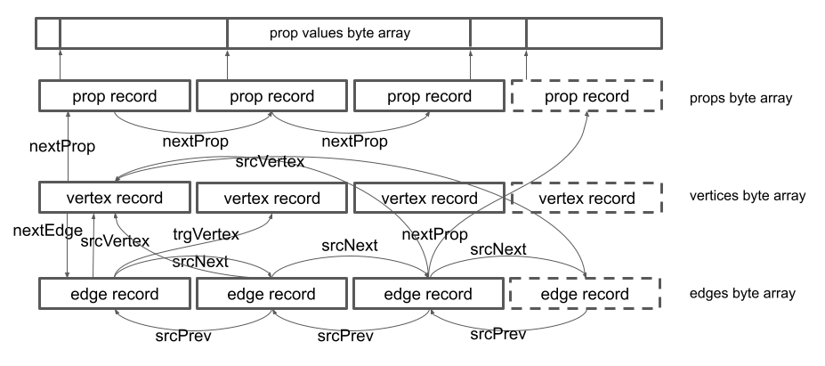
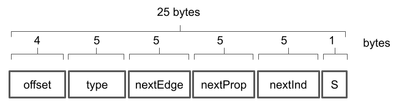
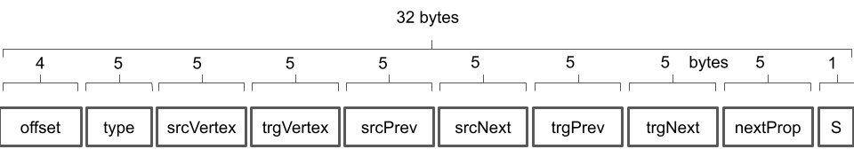
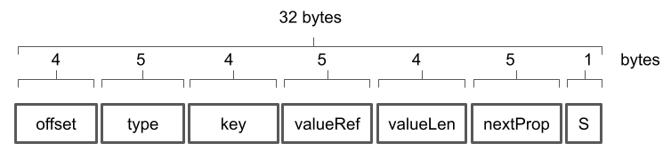
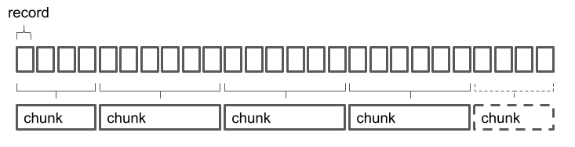
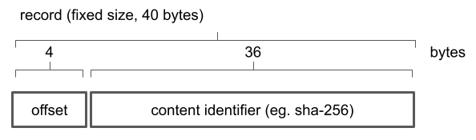
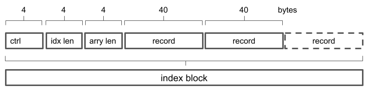

# Storage Format

Neo4j inspired index-free adjacency. Vertices, edges and properties are stored in distinct, single category, byte arrays. The records are having _fixed size_. The records are identified by their offset in the byte array. References are merely pointers to byte array offsets. The (property) values are stored as _variable size_ records in a dedicated byte array. The (property) value records are identified and referenced by their offset and the corresponding byte length in the byte array. Both vertices and edges can have properties.

# Vertex Binary Format

Vertices are stored as fixed size records of 25 bytes. First 4 bytes represent the vertex identity and corresponds to the offset in the byte array storage. The next 5 bytes describe the vertex type. First byte of the 5 byte sequence is a marker for existence of the type specification. Can store additional flags in the future. The next 5 bytes represent a reference to the first edge in the edge list associated with the vertex. The next 5 bytes represent a reference to the first property in the property list associated with the vertex. Last byte describes the record status, such `created`, `modified` or `deleted`.

# Edge Binary Format

Edges are stored in a double-linked list as fixed size records of 32 bytes. First 4 bytes represent the edge identity and corresponds to the offset in the byte array storage. The next 5 bytes describe the edge type. The next 5 bytes represent a reference to the source vertex. The next 5 bytes represent a reference to the target vertex. The next 5 bytes represent a reference to the previous edge in the edge list associated with the source vertex. The next 5 bytes represent a reference to the next edge in the edge list associated with the source vertex. The next 5 bytes represent a reference to the previous edge in the edge list associated with the target vertex. The next 5 bytes represent a reference to the next edge in the edge list associated with the target vertex. The next 5 bytes represent a reference to the first property in the property list associated with the edge. Last byte describes the record status, such `created`, `modified` or `deleted`.

# Property Binary Format

Properties are stored as fixed size records of 32 bytes. First 4 bytes represent the property identity and corresponds to the offset in the byte array storage. The next 5 bytes describe the property type. The next 4 bytes are the property key. The next 5 bytes are the offset of the property value in the property value byte array. The next 4 bytes represent the byte length of the property value. The next 5 bytes represent a reference to the next property in a given property list. Last byte describes the record status, such `created`, `modified` or `deleted`.

# Byte Array Chunking

Network transfer efficiency is reached by partitioning the large byte arrays associated with vertices, edges, properties and property values into smaller chunks. It is also imperative that the chunking algorithm remains stable, which is generates identical chunks for contiguous unchanged data. At this stage, the graph library employs content-defined chunking for all underlying byte arrays, more specifically the [FastCDC algorithm](https://github.com/nlfiedler/fastcdc-rs).

Each chunk is identified by its content-identifier (CID). The CID is a cryptographic hash (such SHA-256) of the chunk content. The chunk information is organized in a cid-by-offset search index so that data associated with ranges in the byte array can be accessed extremely efficient - O(1). The records have a fixed size of 40 bytes. The first 4 bytes represent the relative chunk offset in the logical byte array. The next 36 bytes are the CID:

The index header stores the index length as well as the byte array length:

Any byte array record can be accessed or modified using the index handle (the CID of the index), the record absolute offset and record size. An externalized [generic library](https://github.com/dstanesc/store-chunky-bytes) is used for logical byte array editing.
